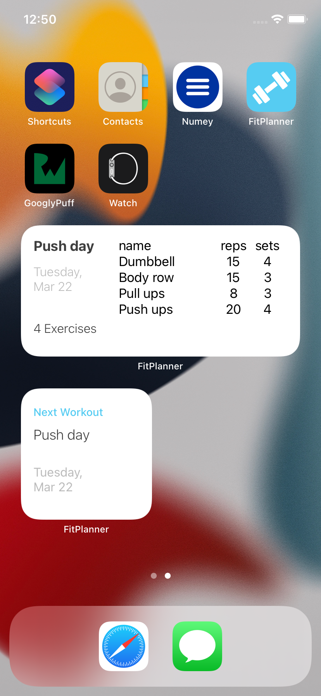

# FitPlanner

A simple and beautiful fitness app that allows you to create your own custom workout plans and makes them easy to stick to.

## Motivation

Before covid lockdown, I used to be super active in school. I was part of the JROTC program and would work out with my friends regularly. I loved working out, but when the pandemic began, I stopped working out and got lazy. I build this project because I want to rebuild the habit of working out regularly. 

## Who is this for?

Primarily for me, but also for anyone who wants to take back their fitness and create a plan that works for them. 

## Preview Samples

     

## Features

- User can register when they first open the app
- Create, read, edit, and delete custom workouts
- Local notifications to remind you of your next workout
- Track your workouts
- Widgets reminding you of your next workout
- Update your weight
- Track your BMI progression

## Tech Stack

- Swift, UIKit, SwiftUI, WidgetKit, CoreData, Cocoapods: FSCalendar
- Build using MVVM design pattern (with inspiration from VIPER)

## Requirements

- XCode 13, Swift 5, iOS 15

## Instalation

Type ```git clone https://github.com/Aldo10012/FitPlanner.git``` into your terminal

## Usage

When you first open the app, you will be prompted to register. To register, enter your name, height, weight, and select a photo.

 

After you register, you can see on the home dashboard. Here, you can see what your next workout is and a calendar displaying your activity. If you tap on "Workout" in the tabbar, you will be redirected to your WorkoutLog, where you can see all of your workouts

   

You are able to add a workout by tapping "Create New Workout", edit an existing workout by tapping on a workout card in WorkoutLog, delete a workout by swiping left on a workout card, and mark a workout as done by tapping "View" on the NextWorkoutCard in home (given that that workout is today).

   

You can see where you stand on the BMI scale. As time progresses, you can update your weight and this will update the scale for you. You can also see your weight and bmi history to see your improvements. 

   

When on the home screen, you can see any of three widgets. Each one displays information of your next workout, acting as a visual reminder.

 
